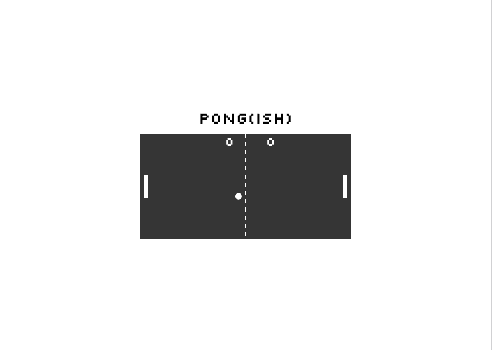

# Pong Game

A basic pong game using SVGs.

## Setup

**Install dependencies:**

`> npm i`

**Run locally with Webpack Dev Server:**

`> npm start`

**Build for production:**

`> npm run build`

## Keys

- spacebar: pause

**Player 1:**

- w: up
- s: down

**Player 2:**

- ▲ : up
- ▼: down

**Built With**

JavaScript - used to create the board, paddles, ball, score board

**Author**

- Kyle Tecson
